#RTK-000-003 Robot Assembly Guide

This is the instruction guide to assemble your new robot that has arrived. 

What is included:

* Robot Chassis
* 2 Wheels
* 2 Motors
* Wi-Fi Adapter
* RTK-000-001 Motor Driver Kit
* 2 AA Battery Boxes (One with and one without a switch
* Screws & Nuts
* Caster Wheel
* Wires
* Screwdriver

You will require to assemble your RTK-000-001 either before or near the end of assembling your kit. Instructions can be found in the <a href="rtkGuide.md" target="_blank">rtkGuide.md</a> file

##1 - Preparing for assembly
First start by laying out all of the parts on a table or desk, then take the parts out of the bag containing the motors and put all of the screws into a little bowl or dish to keep them from getting lost.

<a href="" target="_blank">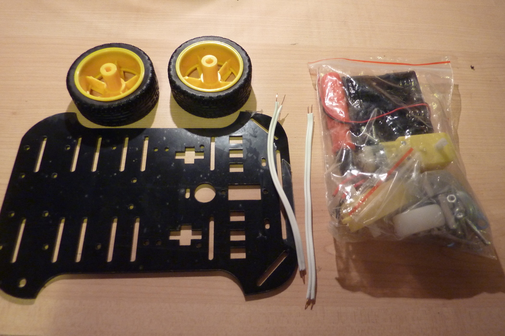</a>

Next lay out the following parts:

* 2 Medium, 2 Nuts and 2 extra long screws with metal block for both motors. (Encoders are optional)
* 4 Nuts, 4 Small screws & 4 stands for the casterwheel at the bottom.

<a href="" target="_blank">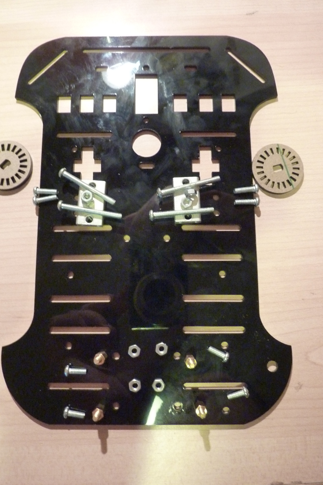</a>

Now place these safely on one side for assembly.

##2 - Assembling the motors
First we need to solder the wires to the motors, for this you can either use the slightly thicker wire or the thinner wire included. Both work the same but we find the thicker wire is slightly better and more robust.

To do this use a small screwdriver to pop the plastic protector off the end of the motor and then solder the cable to the motor, after put the wire back over the motor (you may need to separate the wire a little bit at the motor to put the plastic cover back through. After then clip it onto the motor and repeat for the other motor.

<a href="" target="_blank">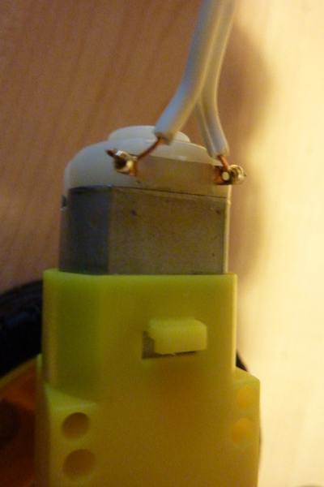</a><a href="" target="_blank">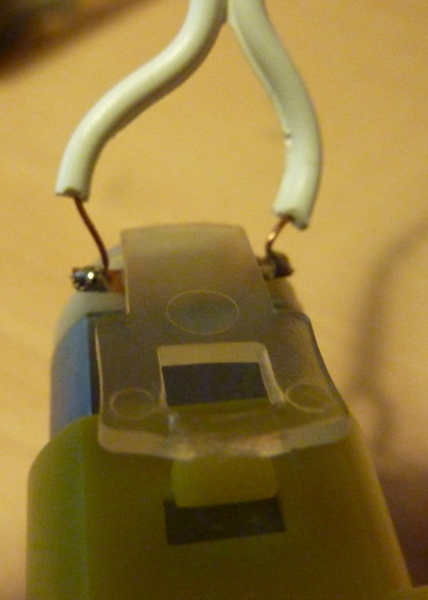</a>

Next it's time to assemble the motors and screw them onto the chassis. To do this start by getting one of the two metal blocks, push the screw in so the thread is on the same side as the wire and then place the block over the screws and secure using the screwdriver and included nuts.

Your motor should look like the following,

<a href="" target="_blank">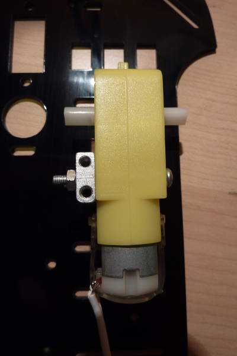</a>

Do the same for the other motor but make sure you do it on the opposite side, then take the medium screws and screw into the two wholes at either side of the chassis. It should then look like this.

<a href="" target="_blank">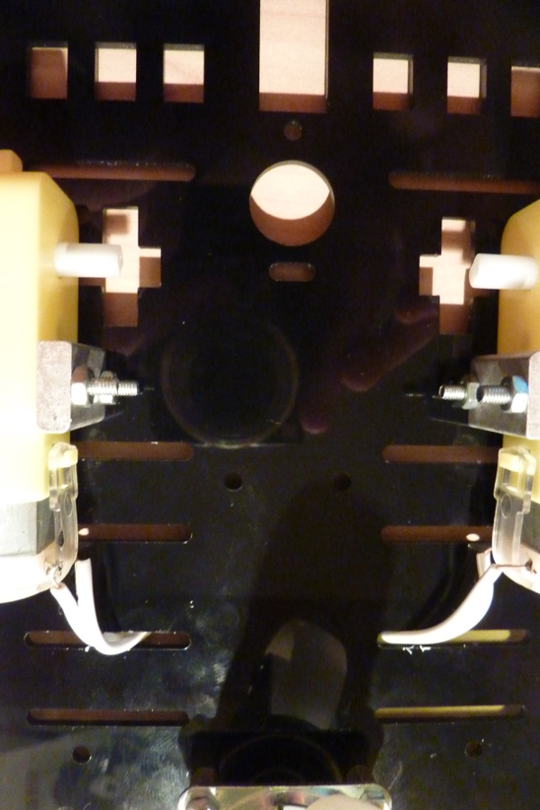</a>

If you wish to use the encoders you can place the two plastic discs on the inside of the robot motors.

##3 - Caster Wheel
Next we need to screw the casterwheel to the robot, start by getting the 4 smaller screws, 4 standoffs and 4 nuts.

Start by screwing the standoffs into the casterwheel using the nuts. Your casterwheel should look like the following picture. You may find you need to use a pair of pliers to carefully tighten the nuts up.

<a href="" target="_blank">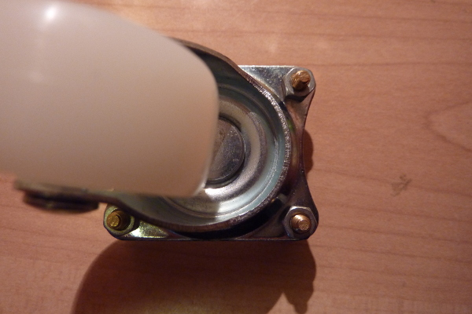</a> <a href="" target="_blank">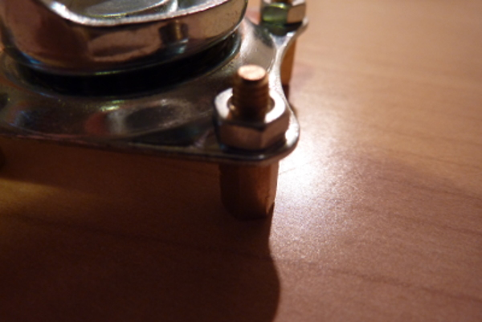</a>

Next then use the screws to screw the wheel into the 4 holes at the bottom of the chassis, 

<a href="" target="_blank">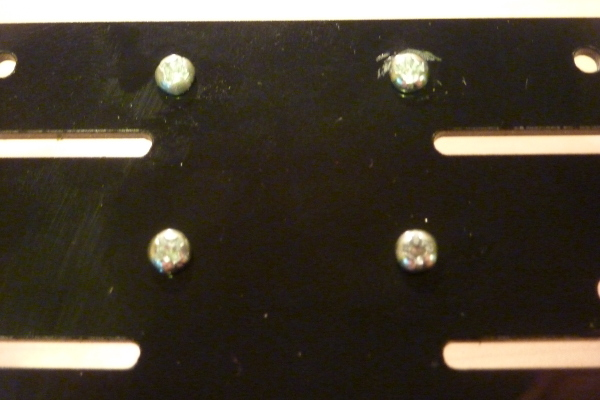</a>

Finally place the two wheels on the sides of the motors and then you should have the chassis completed.

<a href="" target="_blank">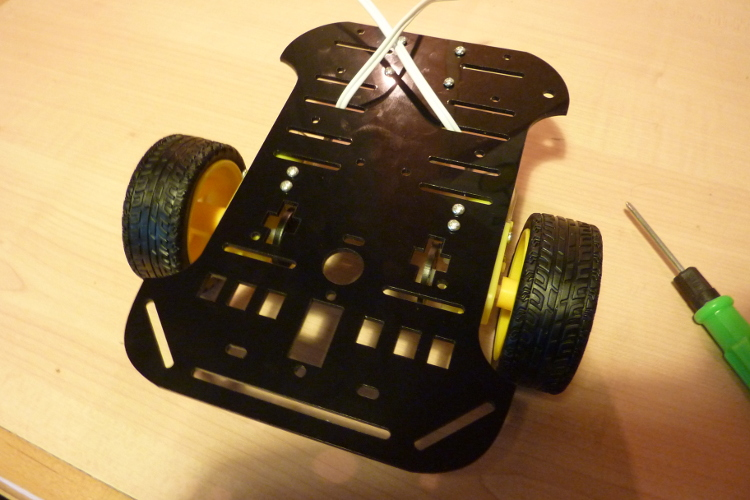</a>

##4 - Putting it all together
For this you will require the following:

* Completed robot chassis
* Soldered RTK-000-001 Driver
* Battery Pack of Choice
* Raspberry Pi, Model B Rev 2 Recommended
* Included Wi-Fi adapter
* Power source for Raspberry Pi, see the<a href="../handyTipsGuides/powerMethods.md" target="_blank"> Power methods</a> guide in the handyTipsGuides folder.
* Bluetak or double sided sticky tape

Start by placing 4 small pieces of bluetak over the 4 screws at the back of the robot to help prevent the Pi from being short circuited. Next place your Pi here with the GPIO pins at the back of the robot.

We then place the battery pack at the front of the robot and then the motor board clips onto the Pi and the motors then screw into the terminal blocks at the sides. Don't worry about the polarity of the two motors as to fix this it is as simple as then swapping the two cables around for that motor.

Finally plug the Wi-Fi adapter into the Raspberry Pi  along with an SD card and then apply Power to the Pi from one of the methods found on the power methods guide.

Your robot should look like the following:, don't forget your robot can be put together how ever you want, this is just the way we find it the best.

<a href="" target="_blank">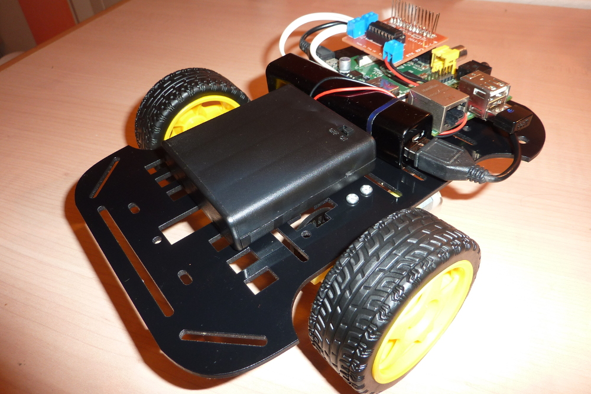</a>

