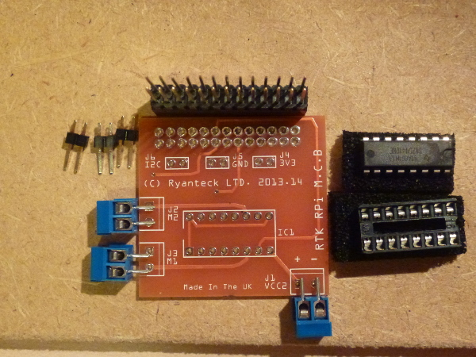

#RTK-000-001 V2 Assembly Instructions
These are the instructions on how to solder the RTK-000-001 Kit up ready for use. These instructions apply for both the kits on their own and the kits packaged with the robots as they are identical.

##Tools Required:
The following tools are required for assembly:
* Soldering Iron (30W or above is recommended) with a small tip. (We find http://www.maplin.co.uk/p/antex-30w-soldering-iron-includes-stand-n11by and http://cpc.farnell.com/tenma/21-10115-uk/soldering-station-digital-esd-uk/dp/SD01738?in_merch=Featured%20Products&MER=e-bb45-00001001 good soldering irons).
* Solder (Lead Free is recommended)
* Solder Cleaner, Brass shavings are recommended but sponges are handy too.
* Raspberry Pi, we find it easier to solder one part on while on a Pi

Helping hands can help with assembly but are not required.

##Warning - Soldering Irons
Use with care, when using a soldering iron you can burn yourself if not careful.
Lead Free solder is also recommended over Lead solder as it contains no lead, but requires the soldering iron to be hotter. I find I normally need to have my soldering iron at 300-350 Degrees. Most 30W soldering irons get into and above this range easily.

##Tutorial:

First start by confirming that you have all of the pieces out of the pack, it should contain:
* 1 X RTK-000-001 PCB
* 1 X SN754410NE (The IC)
* 1 X 16 Pin IC Socket
* 1 X 26 extra tall 26 way pin header
* 3 X Two Way terminal screw blocks
* 3 X Two Pin Headers

###Soldering the IC Socket
First start by soldering the IC socket to the board, to do this insert the socket in with the notch lining up on the PCB, turn upside down and then solder, the foam from the socket can help to keep the PCB stable while soldering as seen below.

###Soldering the terminal blocks
Next solder the terminal blocks, place the blocks in with the terminals pointing outwards and then solder one pin of each socket. By doing only one pin you are able to check that they all are flush to the board and if not amend by heating the pin up and then pushing the terminal block in place.
  

###Soldering the 26 Pin GPIO header
Now we need to solder the hardest part of the kit, the 26 Pin GPIO header, we find it easiest to first fit the GPIO header onto the Raspberry Pi and then solder two pins from oposite corners to make the board flat and hold it for the other 24 pins. After then solder all of the pins making sure you are careful not to cause a bridge or accidently melt another piece of the board. This will take time to get correct so do not rush this step otherwise there is a high chance you can make a mistake.
Placing the pins ready and then soldering the top left and bottom right pins.
  

Soldering the harder bottom row and then the top row.

  

###Soldering the 2 Pin Headers (Optional)
If you wish to also have the extra I2C, GND and 3V3 Pins then you can solder them on now, this may be tricky as you will need something to help keep the pins in place, a sponge normally can help or a piece of wood.
  

###Fitting the IC Into the Socket
Finally take the IC out of its foam and then insert into the socket, you will require to bend the pins slightly to fit it in. Make sure you fit it in with the notch aligning the notch on the socket (Closest to the two terminal blocks if the IC socket has been accidently put in the wrong way round).

