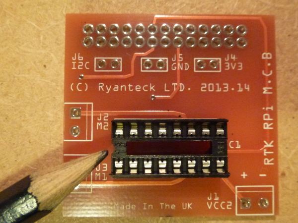

#RTK-000-001 V2 Assembly Instructions
These are the instructions on how to solder the RTK-000-001 Kit up ready for use. These instructions apply for both the kits on their own and the kits packaged with the robots as they are identical.

##Tools Required:
The following tools are required for assembly:
* Soldering Iron (30W or above is recommended) with a small tip. (We find http://www.maplin.co.uk/p/antex-30w-soldering-iron-includes-stand-n11by and http://cpc.farnell.com/tenma/21-10115-uk/soldering-station-digital-esd-uk/dp/SD01738?in_merch=Featured%20Products&MER=e-bb45-00001001 good soldering irons).
* Solder (Lead Free is recommended)
* Solder Cleaner, Brass shavings are recommended but sponges are handy too.
* Raspberry Pi, we find it easier to solder one part on while on a Pi

Helping hands can help with assembly but are not required.

##Warning - Soldering Irons
Use with care, when using a soldering iron you can burn yourself if not careful.
Lead Free solder is also recommended over Lead solder as it contains no lead, but requires the soldering iron to be hotter. I find I normally need to have my soldering iron at 300-350 Degrees. Most 30W soldering irons get into and above this range easily.

##Tutorial:

First start by confirming that you have all of the pieces out of the pack, it should contain:
* 1 X RTK-000-001 PCB
* 1 X SN754410NE (The IC)
* 1 X 16 Pin IC Socket
* 1 X 26 extra tall 26 way pin header
* 3 X Two Way terminal screw blocks
* 3 X Two Pin Headers

###Soldering the IC Socket
First start by soldering the IC socket to the board, to do this insert the socket in with the notch lining up on the PCB, turn upside down and then solder, the foam from the socket can help to keep the PCB stable while soldering as seen below.

###Soldering the terminal blocks

###Soldering the 26 Pin GPIO header

###Soldering the 2 Pin Headers (Optional)

###Fitting the IC Into the Socket
