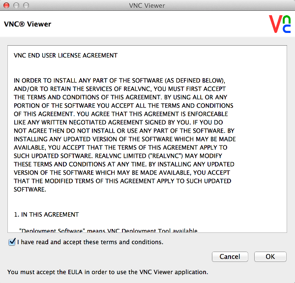

Connecting to your Raspberry Pi using VNC
=============
First you need to know the IP address of your Raspberry Pi and make sure it is already connected to the same network. See findingYourIp & wirelessConnection guides.

Cross platform
-----------
There are two cross platform methods to connect to a VNC server running on the raspberry Pi.
###VNC Viewer for Google Chrome
One of the easiest ways to be able to connect to your Raspberry Pi is by installing the VNC Viewer for Google Chrome application from https://chrome.google.com/webstore/detail/vnc-viewer-for-google-chr/iabmpiboiopbgfabjmgeedhcmjenhbla
This is maintained by RealVNC who maintain their own version of VNC which can offer extra features for a paid price. The client for chrome is free to use.

After downloading navigate to <a href="chrome://apps" target="_blank">chrome://apps</a> in chrome and then click on the VNC icon (You may have to swap pages using the arrows at the sides). After you should be presented with the following screen.

Next type the IP Address of your Raspberry Pi with a :1 after (without spaces) into the address box. Leave quality as automatic (this will pick the best quality / speed mixture for you, over a LAN network this should be good quality and speed).
After you may have an warning message appear about not using an encrypted connection, this is not an issue as you are not transmitting confidential information and are on a local area network.

You should now be connected to your Raspberry Pi!

Windows
-----------
Coming Soon...

Android
----------
Coming Soon...

Linux - Ubuntu
-----------
Coming Soon...

Mac OSX
-----------
On mac, you can use the chrome web app VNC Viewer like mentioned in the cross platform section of this file. If you wish to use an installed aplication, you can download and use the VNC Viewer mac program. To download hear over to [http://www.realvnc.com/download/viewer/](http://www.realvnc.com/download/viewer/)

Download the mac .dmg by find the section titled Mac OS X and clicking the Download button in it

To download, it will ask you to fill out a form. You only have to put in your name and email address before clicking submit.

Then, before downloading, it will ask you to agree to the VNC END USER LICENCE AGREEMENT. Read it if you wish. To download, tick the  I have read and accept these terms and conditions tickbox underneath the agreement, then press the download button below that

The download will then begin shortly. It should only take a couple of seconds to download the 2.4mb .dmg mac installer file.

You will find the .dmg installer file in your downloads. Double click on it to mount it.

Once mounted, drag the VNC Viewer icon to your application folder to have a copy of it saved to your applications folder. Double click on the VNC Viewer icon to open it, once you have a copy of it in your downloads. It may come up with a warning 'VNC Viewer is an application download from the internet. Are you sure you want to open it?'. Answer with 'Open'. Then the installer opens. You have to agree to the end user licence again by checking the tickbox and clicking ok to continue (again, have a read through if you wish).

VNC Viewer will then apear as it will apear in the future times you open it from your applications.

To connect to your Pi's VNC server, you will need to know your Pi's IP Address. Find it out in the findingOutYourIpAddress handy guide. Then, in the VNC Server box, type the IP Address of your Raspberry Pi with a :1 after (without spaces). Leave the dropdown as let vnc server choose and press Connect. After you may have an warning message appear about not using an encrypted connection, this is not an issue as you are not transmitting confidential information and are on a local area network.

You should now be connected to your Raspberry Pi!

-Written by Zachary Igielman

iOS Devices (iPad)
----------
On iPad, the best way to connect to your Pi's VNC Server is to download the App VNC Viewer from the App Store and use that (This tutorial is entirel transferrable to iPhone).

Firstly, open the App Store and find the VNC Viewer app. Search 'vnc viewer' and tap on the one that looks like this:

Download it (press on the FREE button, then press INSTALL) and enter your Apple ID password to sign into the iTunes Store (if you don't have an Apple Id, you'll ahve to make one, and if you haven't logged in before, it will ask for your email and password that you used for your apple id). Wait for it to download. Once downloaded, this icon will apear on one of your home screens:

Tap on it to open it and this window will apear:

Tap the + button in the top right corner to add a connection. This window will then appear:

Put your raspberry pi's ip address (to find it out, look at the handy guide to finding your ip address) followed by :1.

Press save and then connect. After you may have an warning message appear about not using an encrypted connection, this is not an issue as you are not transmitting confidential information and are on a local area network. You should now be connected to your Raspberry Pi!

The next time you connect, it will saved the details for the connection that you inputted. This may be handy as you don't have to re enter the details for the connection every time. Note that your Pi's ip address may change on reboot, especially if device leave or join your network when your Pi is off, so if the connection does not work, find your Pi's new ip address and connect again.

-Written by Zachary Igielman
