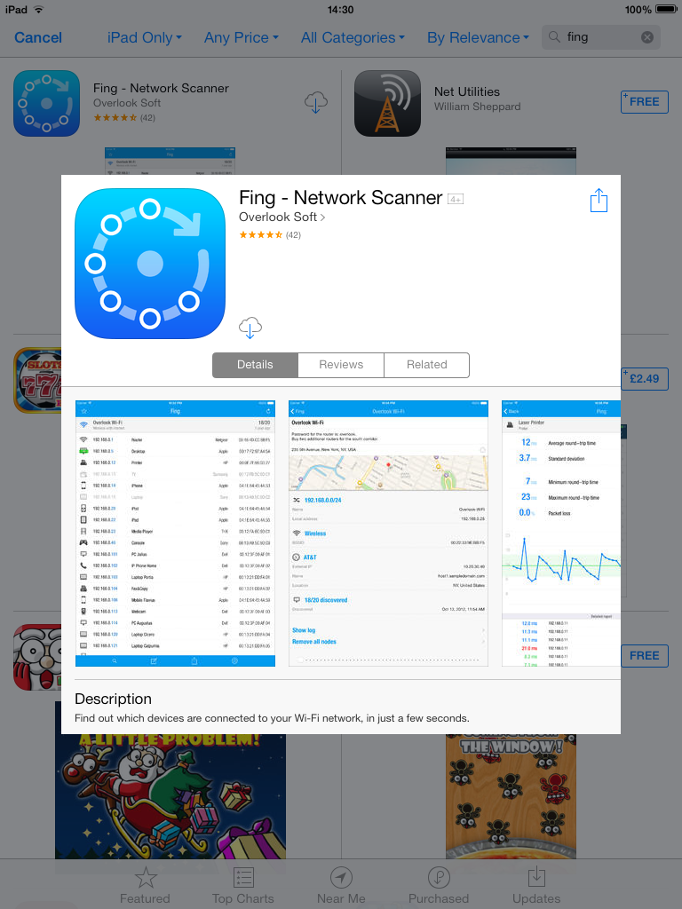
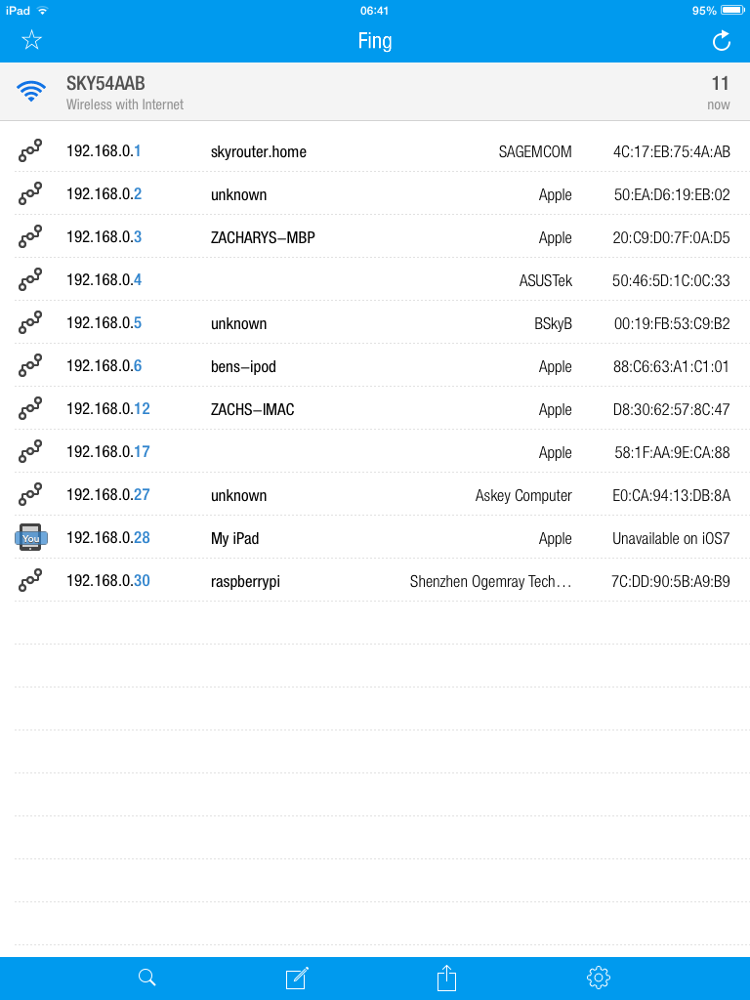

How to find your Raspberry Pi's IP Address
===========
We found the easiest way to find an IP address of your Raspberry Pi is using a handy tool called Fing.
Android
-------
First you will have to install an application called Fing onto your Android device, to do this you can either look in the app store for "Fing" or click the following link and click the install button. https://play.google.com/store/apps/details?id=com.overlook.android.fing

After the application has installed it is as simple as launching it and then clicking the refresh icon in the top right of the application. You should see all of the devices on the network appear.


A Raspberry Pi connected via the ethernet cable will show as Raspberry Pi Foundation, the Wi-Fi adapters we provide identify as Shenzhen Ogemray Technology which is the IP address we want.
Make a note of this IP address and you are done!, You can also assign icons to each device by pressing down the button and clicking change icon. At the bottom there is one for Raspberry Pi.


Windows
-------
First download Fing from Overlook's website at http://www.overlooksoft.com/download, select the windows installer and install it. Then after installation reboot your computer. 
Next start Fing by going to Start->All Programs ->Overlook Fing->Fing then select D to discover devices on the network. Type the letter of the network device you wish to use and then type in 1 for one discovery round, N for no domain names, enter for file and then T for table output, text for text output, c to output to console and then N t ocomplete. Finally press y to execute the command.
You should then get the output, for our wi-fi adapters you are looking for Shenzhen Ogemray Technology. An example output is below


Ubuntu 
-----
Tested on Ubuntu 14.04 and 13.10
First download Fing from Overlook's website ( http://www.overlooksoft.com/download) , for ubuntu and other debian based operating systems select the DEB and the architecture you are using (This is likely 64-bit on a modern computer).

After it has downloaded click on the icon and then the Ubuntu Software Centre should Load, then click the install button and then fing should be installed.
Then open up a terminal window and then run the command ```sudo fing``` and fing will run and display a list of all the IP addresses. and their devices. You are looking for the IP address of the device that shows up as Shenzhen Ogemray Technology.


If you are on a computer with multiple network devices you will have to specify which device to use, on most computers wireless is wlan0 and cable is eth0 as default. Do this by instead typing ```sudo fing wlan0``` 


Linux (DEB) Command Line 
-----
Tested on Ubuntu 14.04 and 13.10, should be compatible with Debian as well.
First download Fing by running the following command, change the lx64 to lx32 if you are running a 32 bit version of Linux.
```wget "http://www.overlooksoft.com/packages/download?plat=lx64&ext=deb" -O fing.deb```
next you can install it by typing ``` sudo dpkg -i fing.deb ```

It should now be installed.

Next run the command ```sudo fing``` and fing will run and display a list of all the IP addresses. and their devices. You are looking for the IP address of the device that shows up as Shenzhen Ogemray Technology.
A picture of the output can be found above in the ubuntu section. If you are on a computer with multiple network devices you will have to specify which device to use, on most computers wireless is wlan0 and cable is eth0 as default. ```sudo fing wlan0```

Linux (RPM)
-----
Coming soonn..

Mac
---

On mac, you can open your router's configuration page in an internet browser to find out connected devices and their ip adresses, but that is complicated and varies for each router. It is easier to use fing to search view the devices on your network and their ip addresses.

To download fing on a mac, go to [http://www.overlooksoft.com/fing](http://www.overlooksoft.com/fing) and click on the Download Now button.


Scroll down to the Fing for Desktops section because we are installing it on a computer, not a mobile device. Click on the OS X Installer to download it.


A few seconds later, a .DMG package file should start to download. It should only take a few seconds to download the ~4mb installer package. Once downloaded, find it in your downloads and click on it to mount it. When mounted, this window should apear:


That .pkg is the package installer that we want to use to install fing. It is not the application so there is no need to save it to your applications. Double click on it to open it.


Follow the installer step-by-step to download fing:
1. Press continue in the first page
2. Read the important information if you wish to, and then press continue
3. Read through the license if you wish to, and then press continue
4. Press Agree (press to read it first if you want to) to agree to the licence
5. Press Install (if you want to install it on your Macintosh HD in the applications folder, if not, before pressing install, press Change Install Location and choose somewhere else and then press Install)


It may ask for you to enter your password to allow it to install new software (if you are not in an admin account, you will have to enter the Name and Password of an admin account to allow it to install new software). Enter your password (and name if you have to) and then click install software. The install will then begin and within a few seconds it will be over.


Press close in the installer window and disregard the installer (delete the .dmg file in your downloads and eject the mounted dmg).

Open terminal to use fing because it is a command line tool (click on Terminal in Applications>Utilities).

Next run the command ```sudo fing``` and fing will run and display a list of all the IP addresses and their devices. You are looking for the IP address of the device that shows up as Shenzhen Ogemray Technology. If you are on a computer with multiple network devices you will have to specify which device to use, on most computers wireless is wlan0 and cable is eth0 as default. ```sudo fing wlan0```

Here is the output of ```sudo fing``` on my mac. The area in bold is the device you're looking for and my pi's ip address would be 192.168.0.30:
```
11:33:28 > Discovery profile: Default discovery profile
11:33:28 > Discovery class:   data-link (data-link layer)
11:33:28 > Discovery on:      192.168.0.0/24

11:33:28 > Discovery round starting.
11:33:28 > Host is up:   192.168.0.3
           HW Address:   20:C9:D0:7F:0A:D5 (Apple)
           Hostname:     zacharys-mbp

11:33:28 > Host is up:   192.168.0.1
           HW Address:   4C:17:EB:75:4A:AB (SAGEMCOM)
           Hostname:     skyrouter.home

11:33:28 > Host is up:   192.168.0.5
           HW Address:   00:19:FB:53:C9:B2 (BSkyB)
           Hostname:     unknown

11:33:28 > Host is up:   192.168.0.2
           HW Address:   50:EA:D6:19:EB:02 (Apple)
           Hostname:     zacharys-iphone

11:33:28 > Host is up:   192.168.0.12
           HW Address:   D8:30:62:57:8C:47 (Apple)
           Hostname:     zachs-imac

11:33:28 > Host is up:   192.168.0.27
           HW Address:   E0:CA:94:13:DB:8A (Askey Computer)
           Hostname:     unknown
```
**11:33:28 > Host is up:   192.168.0.30
           HW Address:   7C:DD:90:5B:A9:B9 (Shenzhen Ogemray Technology)
           Hostname:     raspberrypi**
```
11:33:29 > Discovery progress 25%
11:33:30 > Discovery progress 50%
11:33:30 > Host is up:   192.168.0.4
           HW Address:   50:46:5D:1C:0C:33
           Hostname:     unknown

11:33:31 > Discovery progress 75%
-------------------------------------------------------------------------------
| State | Host                              | MAC Address       | Last change |
|-----------------------------------------------------------------------------|
|  UP   | 192.168.0.1                       | 4C:17:EB:75:4A:AB |             |
|  UP   | 192.168.0.2                       | 50:EA:D6:19:EB:02 |             |
|  UP   | 192.168.0.3                       | 20:C9:D0:7F:0A:D5 |             |
|  UP   | 192.168.0.4                       | 50:46:5D:1C:0C:33 |             |
|  UP   | 192.168.0.5                       | 00:19:FB:53:C9:B2 |             |
|  UP   | 192.168.0.12                      | D8:30:62:57:8C:47 |             |
|  UP   | 192.168.0.27                      | E0:CA:94:13:DB:8A |             |
|  UP   | 192.168.0.30                      | 7C:DD:90:5B:A9:B9 |             |
-------------------------------------------------------------------------------

11:33:33 > Discovery round completed in 4.786 seconds.
11:33:33 > Network 192.168.0.0/24 has 8/8 hosts up.

11:33:33 > Next round starting at 11:34:28. Press Ctrl^C to exit.
```
I pressed Ctrl+C to stop.

You have now found your ip address on you mac using fing, well done!

-Written by Zachary Igielman

iOS
---

YOUR IPAD OR iOS DEVICE MUST BE CONNECTED TO A ROUTER TO CONTINUE

On iPad, the best way to  view the devices connected to your router and their ip addresses is to download the App Fing - Network Scanner from the App Store and use that (This tutorial is transferrable to iPhone).

Firstly, open the App Store and find the Fing - Network Scanner app. Search 'fing' and tap on the one that looks like this:



Download it (press on the FREE button, then press INSTALL) and enter your Apple ID password to sign into the iTunes Store (if you don't have an Apple Id, you'll have to make one, and if you haven't logged in before, it will ask for your email and password that you used for your apple id). Wait for it to download. Once downloaded, this icon will apear on one of your home screens:


Tap on it and a list of the devices on your router and their ip address apears. You are looking for the IP address of the device that shows up as Shenzhen Ogemray Technology. This is what my app showed. The last device is clearly the Raspberry Pi as it says Shenzhen Ogemray Technology which is the brand of our wifi dongle, and the ip of it is 192.168.0.13.



Look for a Shenzhen Ogemray Technology on your list, look in the ip address column and you have now found your ip address on you iPad (or other iOS device) using fing, well done!

-Written by Zachary Igielman
