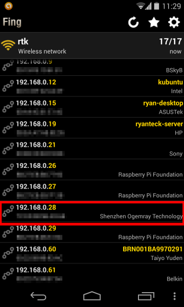
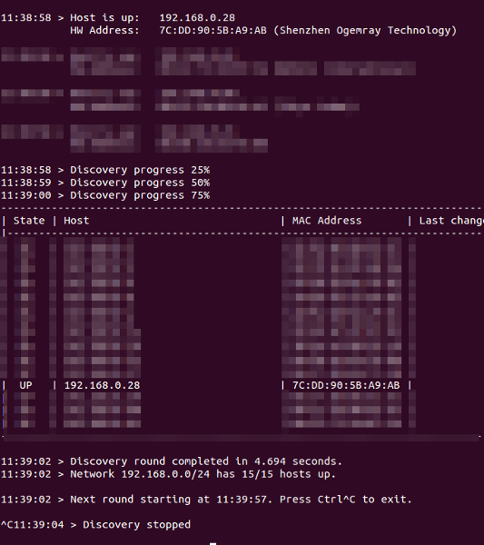
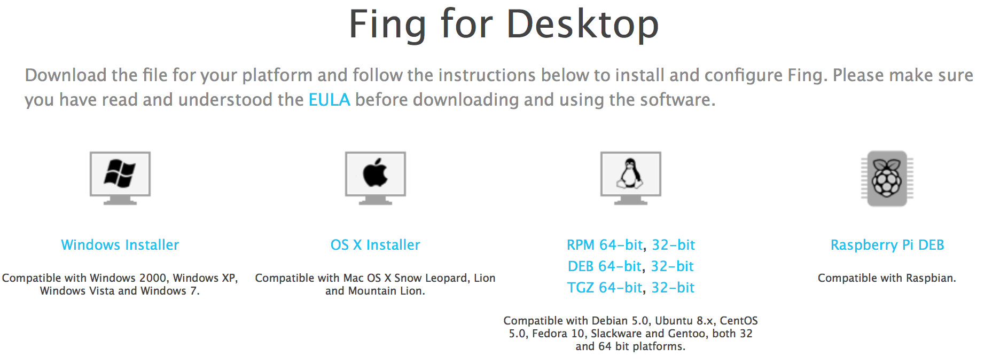
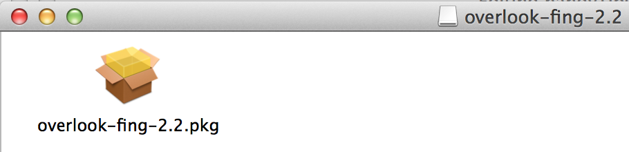
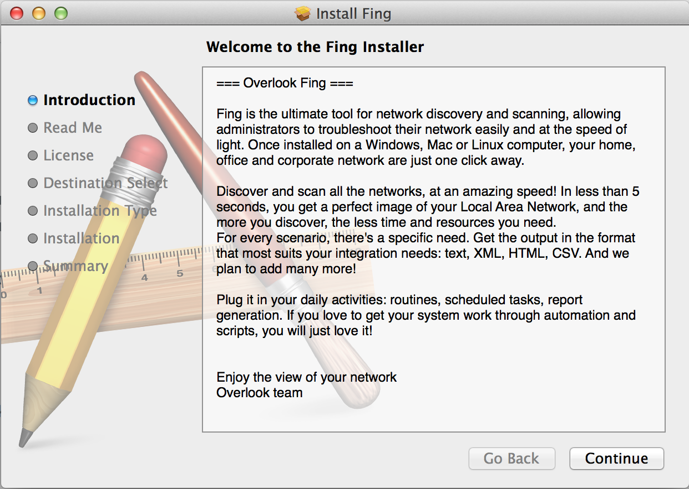
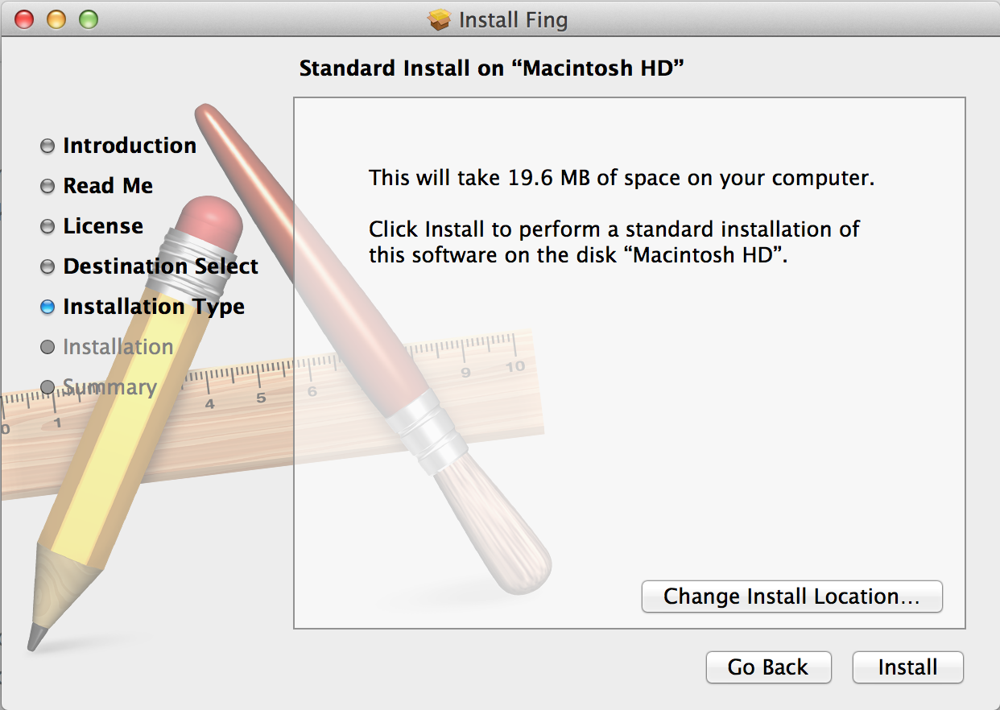

How to find your Raspberry Pi's IP Address
===========
We found the easiest way to find an IP address of your Raspberry Pi is using a handy tool called Fing.
Android
-------
First you will have to install an application called Fing onto your Android device, to do this you can either look in the app store for "Fing" or click the following link and click the install button. https://play.google.com/store/apps/details?id=com.overlook.android.fing

After the application has installed it is as simple as launching it and then clicking the refresh icon in the top right of the application. You should see all of the devices on the network appear.



A Raspberry Pi connected via the ethernet cable will show as Raspberry Pi Foundation, the Wi-Fi adapters we provide identify as Shenzhen Ogemray Technology which is the IP address we want.
Make a note of this IP address and you are done!, You can also assign icons to each device by pressing down the button and clicking change icon. At the bottom there is one for Raspberry Pi.


Windows
-------
First download Fing from Overlook's website at http://www.overlooksoft.com/download, select the windows installer and install it. Then after installation reboot your computer. 
Next start Fing by going to Start->All Programs ->Overlook Fing->Fing then select D to discover devices on the network. Type the letter of the network device you wish to use and then type in 1 for one discovery round, N for no domain names, enter for file and then T for table output, text for text output, c to output to console and then N t ocomplete. Finally press y to execute the command.
You should then get the output, for our wi-fi adapters you are looking for Shenzhen Ogemray Technology. An example output is below



Ubuntu 
-----
Tested on Ubuntu 14.04 and 13.10
First download Fing from Overlook's website ( http://www.overlooksoft.com/download) , for ubuntu and other debian based operating systems select the DEB and the architecture you are using (This is likely 64-bit on a modern computer).

After it has downloaded click on the icon and then the Ubuntu Software Centre should Load, then click the install button and then fing should be installed.
Then open up a terminal window and then run the command ```sudo fing``` and fing will run and display a list of all the IP addresses. and their devices. You are looking for the IP address of the device that shows up as Shenzhen Ogemray Technology.


If you are on a computer with multiple network devices you will have to specify which device to use, on most computers wireless is wlan0 and cable is eth0 as default. Do this by instead typing ```sudo fing wlan0``` 


Linux (DEB) Command Line 
-----
Tested on Ubuntu 14.04 and 13.10, should be compatible with Debian as well.
First download Fing by running the following command, change the lx64 to lx32 if you are running a 32 bit version of Linux.
```wget "http://www.overlooksoft.com/packages/download?plat=lx64&ext=deb" -O fing.deb```
next you can install it by typing ``` sudo dpkg -i fing.deb ```

It should now be installed.

Next run the command ```sudo fing``` and fing will run and display a list of all the IP addresses. and their devices. You are looking for the IP address of the device that shows up as Shenzhen Ogemray Technology.
A picture of the output can be found above in the ubuntu section. If you are on a computer with multiple network devices you will have to specify which device to use, on most computers wireless is wlan0 and cable is eth0 as default. ```sudo fing wlan0```

Linux (RPM)
-----
Coming soonn..

Mac
---

On mac, you can load your routers configuration page in an internet browser, but that is complicated and varies for each router. It is easier to again use fing to search the devices on your network.

To download fing on a mac, go to [http://www.overlooksoft.com/fing](http://www.overlooksoft.com/fing) and click on the Download Now button


Scroll down to the Fing for deskptop section 9we are installing it on a computer, not a mobile device) and click on the OS X Installer to download it.



A few seconds later, after the next page loads, a .DMG package should start to download. That should only take a few seconds to download the ~4mb installer package. Find it in your downloads and double-click on it to mount it. When mounted, this window should apear:



That .pkg is the package installer that we want to use to install fing. It is not the application so there is no need to save it to your applications. Double click on it to open it.



Follow the installer through to download fing:
1. Press continue in the first page
2. Read the important information if you wish to and then press continue
3. Read through the license if you wish to and then press continue
4. Press Agree (press to read it if you want to) to agree to the licence (you have to agree to be able to install fing, if you don't agree, you cannot use fing)
5. Press Install (if you want to install it on your Macintosh HD in the applications folder, if not, before pressing install, press Change Install Location and choose somewhere else there and then press Install)



It will ask for you to enter your password to allow it to install new software (if you are not in an admin account, you will have to enter the Name and Password of an admin account to allow it to install new software). Enter your password (and name if you have to) and then click install software. The install will then begin and within a few seconds it will be over.


Press close in the installer window and disregard the installer (delete the .dmg file in your downloads, eject it from being mounted). 

Open terminal to use fing because it is a command line tool (click on Applications>Utilities>Terminal on Mac).

Next run the command ```sudo fing``` and fing will run and display a list of all the IP addresses. and their devices. You are looking for the IP address of the device that shows up as Shenzhen Ogemray Technology.
A picture of the output can be found above in the ubuntu section. If you are on a computer with multiple network devices you will have to specify which device to use, on most computers wireless is wlan0 and cable is eth0 as default. ```sudo fing wlan0```

-Written by Zachary Igielman

iOS
---

This will be done shortly...

-Written by Zachary Igielman
