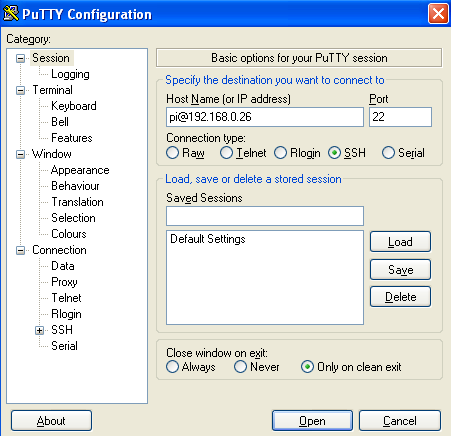
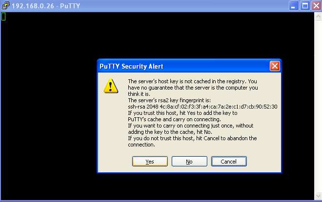
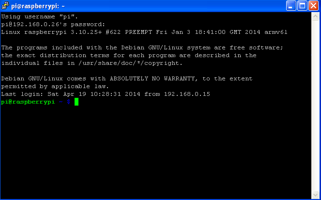
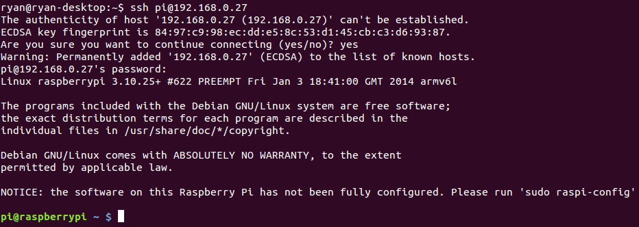

How to connect to your Raspberry Pi via SSH
===========

Windows
---------
To be able to SSH into your Raspberry Pi via a windows computer we will be using a tool called Putty. Putty is a popular freeware tool that can be downloaded from http://the.earth.li/~sgtatham/putty/latest/x86/putty.exe

After downloading this tool it is as simple as opening the program up, and then typing in the Raspberry Pi's username and IP address into the hostname box. It should look like the following:



Next press open to connect to the Raspberry Pi, for your first time you should see the following message to confirm that you wish to add this Raspberry Pi's SSH key to putty. This means if the key changes it will not let you connect without removing the old one. (A key can change due to a harmless error such as a different SD card or it could be if somebody is trying to sniff the network).



Finally type in your Raspberry Pi's password, (Default "raspberry") and you should be now connected!



Linux & Mac
---------
On Linux & Mac the tools required are usually installed already. All that you have to do is open up an terminal window (Ctrl-Alt-T) and then type in the following command:


 ```
ssh pi@192.168.0.10

 ```

Replacing pi with the username (normally pi as default) and replacing 192.168.0.10 with the Pi's IP Address (See findingYourIp.md if you need to find it).

Next type in your Raspberry Pi's password (default "raspberry") and then you will be logged into the command line envrionment.

You may be asked to confirm the SSH key for the first time, to do this just type yes into the console.

The whole process is shown below:




